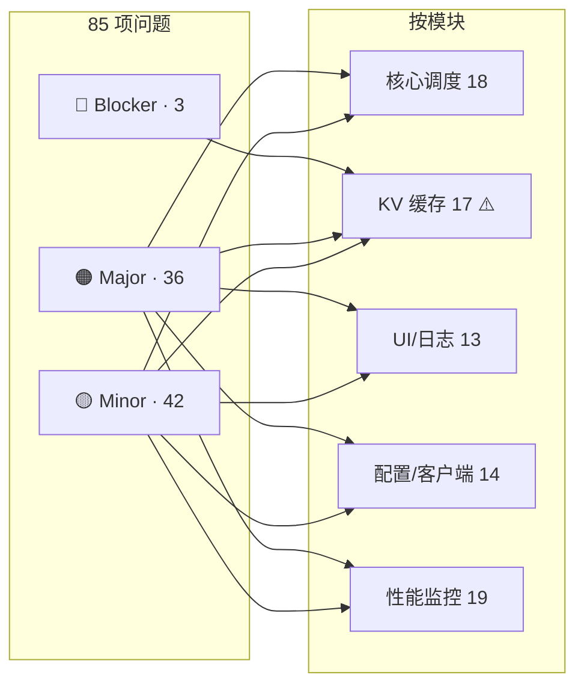
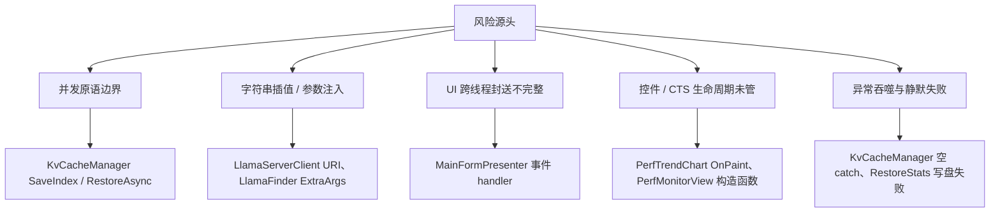

# LlamaHarness 全项目全新完整代码评审报告

> **评审日期**：2026-09-04  
> **评审范围**：全项目 63 个 .cs 源文件（约 18,000 行），覆盖 5 大模块  
> **评审方法**：TRAE-code-review Skill + 5 个独立 sub-agent 并行扫描 + 汇总合并  
> **前置约束**：C# 12 / .NET 8 / WinForms；零第三方 NuGet（纯 BCL）；禁止破坏对外契约

---

## 一、评审范围与规模

| 模块 | 文件数 | 覆盖文件 |
|---|---:|---|
| 核心调度 | 13 | SmartScheduler*.cs、CrashRecovery、RequestProcessor、InFlightTracker、RequestTiming(T)acker、LlamaServerProcess、SchedulerUtils |
| KV 缓存与 Token 治理 | 8 | KvCacheManager、TokenGuard、OutputContinuer、SlotAffinity/PanelView、RestoreStats、LlamaStatsParser、ThinkingMode |
| UI 与日志 | 13 | MainForm*.cs、MainFormPresenter、Program、LogPipeline/LogView/LogFile、Monitor/Status/StatsPanelView、MarkdownRenderer、UiTheme |
| 配置与客户端 | 9 | AppConfig、AppPaths、LlamaServerClient、LlamaFinder、CpuAffinity、AffinityRule/Matcher、IBackendClient、BackendClientFactory |
| 性能监控 | 14 | PerfAnalyzer、PerfMonitorView、PerfSampler、PerfLog、PerfPoint/Series/Event/EventTracker、PerfAlarm、PerfTrendChart、PerfThresholdRule、LlamaCppMonitor、SystemMetrics、MetricKeys |

**前置排除**：已在前一次会话修复完成的 4 Blocker + 部分 Major（B-01/B-02/B-03/B-04、M-01~M-06、M-11 等）已不再计入本轮问题，仅报告本次扫描新发现的 85 项。

---

## 二、问题总览

### 2.1 严重程度汇总

| 严重程度 | 数量 | 处置建议 |
|---|---:|---|
| 🔴 **Blocker**（并发崩溃 / 数据损坏 / 严重安全） | **3** | 必须优先修复 |
| 🟠 **Major**（正确性 / 稳定性 / 性能 / 安全） | **36** | 建议本迭代修复 |
| 🟡 **Minor**（质量 / 可读性 / 边界） | **42** | 可择机修复 |
| **合计** | **85** | |

### 2.2 模块分布

| 模块 | Blocker | Major | Minor | 小计 |
|---|---:|---:|---:|---:|
| 核心调度 | 0 | 8 | 10 | 18 |
| KV 缓存与 Token 治理 | 3 | 6 | 8 | 17 |
| UI 与日志 | 0 | 5 | 8 | 13 |
| 配置与客户端 | 0 | 7 | 7 | 14 |
| 性能监控 | 0 | 10 | 9 | 19 |
| **合计** | **3** | **36** | **42** | **85** |

### 2.3 问题分布 Mermaid 图

---

## 三、🔴 Blocker 详情（3 项 · 必须优先）

### B-1  SaveIndex() 在锁外迭代 `_index` → 并发崩溃 + 索引丢失

- **位置**：[KvCacheManager.cs:L410-L432](file:///c:/project/lunch/LlamaHarness/KvCacheManager.cs#L410-L432)
- **触发路径**：并发调用 `SaveAsync` 与 `ClearAllAsync`（或两个 `RecordSave`），`Dictionary` 迭代器被并发修改
- **表现**：抛 `InvalidOperationException`，被外层 `catch { }` 吞掉 → 索引持久化实际丢失，重启后快照无法恢复
- **修复思路**：`foreach + JsonObject 构造 + ToJsonString` 整体置于 `lock(_gate)` 内，仅 `File.WriteAllText` 留在锁外

### B-2  Sanitize() 空串 / 全非法字符 key → 文件名退化为 `.bin`

- **位置**：[KvCacheManager.cs:L435-L439](file:///c:/project/lunch/LlamaHarness/KvCacheManager.cs#L435-L439)
- **触发路径**：`key = ""` / `"\\"` / `"../"` / `"???"` 全部返回空串
- **表现**：`Path.Combine(_cachePath, ".bin")`；不同业务 key 若都落到空串 → 快照互相覆盖，缓存污染
- **修复思路**：`Sanitize` 返回空串时抛 `ArgumentException`；或改用 SHA256 哈希作为文件名主体

### B-3  slot 参数无上下界校验 → 负数 / 越界静默取模路由

- **位置**：[KvCacheManager.cs:L133, L277, L285, L305](file:///c:/project/lunch/LlamaHarness/KvCacheManager.cs)
- **触发路径**：`slot = -1` → 0；`slot = 999` 且 N=4 → 3
- **表现**：静默路由到错误槽位，KV 快照写错位置，无法复现诊断
- **修复思路**：所有入口统一 `if (slot < 0 || slot >= _slotCount) throw new ArgumentOutOfRangeException(nameof(slot), slot, ...)`

---

## 四、🟠 Major 详情（36 项 · 按模块）

### 4.1 核心调度（8 项）

| # | 位置 | 问题摘要 |
|---|---|---|
| M-C1 | SmartScheduler.cs | `Backend` 懒加载非原子（double-check 缺失） |
| M-C2 | SmartScheduler.Lifecycle.cs | `EnsureRunningAsync` TOCTOU，两次状态检查之间进程可能已死 |
| M-C3 | SmartScheduler.Pipeline.cs:L26-L32 | `req.RawUrl` 未校验，SSRF 风险，可被利用转发到外部主机 |
| M-C4 | SmartScheduler.Gateway.cs | `SegmentPrefixHash` 分隔符冲突，KV-DRIFT 诊断失效 |
| M-C5 | SmartScheduler.Crash.cs | `StopNow` 与 `WakeUpAsync` 状态转换存在竞态窗口 |
| M-C6 | RequestProcessor.cs | 上游取消后无响应清理，可能悬挂 in-flight |
| M-C7 | InFlightTracker.cs | 并发移除时 snapshot 与 remove 非原子 |
| M-C8 | LlamaServerProcess.cs | 进程退出事件重复绑定，`Exited` 事件可能触发多次 |

### 4.2 KV 缓存与 Token 治理（6 项）

| # | 位置 | 问题摘要 |
|---|---|---|
| M-K1 | KvCacheManager.cs:L270 | `RestoreAsync` finally 中无条件 Release 信号量，异常路径下污染并发计数 |
| M-K2 | TokenGuard.cs | 隐形预算裁剪后未同步更新 prompt 指纹，导致误命中旧快照 |
| M-K3 | OutputContinuer.cs | 断点续接失败后未释放已持有的 KV 快照，占位泄漏 |
| M-K4 | SlotAffinity.cs | affinity 分配在 `Dictionary` 上做无锁读写，理论上可读到脏值 |
| M-K5 | LlamaStatsParser.cs | `ParseNonStream` 遇到数组型 `content` 直接抛异常，无降级 |
| M-K6 | RestoreStats.cs | `_dirty` 标记后写盘失败未回滚，重启可能读到半写数据 |

### 4.3 UI 与日志（5 项）

| # | 位置 | 问题摘要 |
|---|---|---|
| M-U1 | MainFormPresenter.cs:L62-L63 | `_schedSlotBindingChangedHandler` 与 `_schedSlotLogHandler` 未封送 UI 线程 |
| M-U2 | MainForm.Ui.cs:L143-L155 | `_paramControls` 数组遗漏 17 个参数控件，busy 阶段仍可编辑 |
| M-U3 | MainForm.Ui.cs:L321-L322 | `ShowDocInPanel` 未 Dispose 已移除的 RichTextBox，GDI 泄漏 |
| M-U4 | MainForm.Ui.cs | `RefreshInFlightTasks` 每次 `new Label/Font`，未缓存复用 |
| M-U5 | LogView.cs | 日志滚动锁粒度过粗，可能阻塞 append |

### 4.4 配置与客户端（7 项）

| # | 位置 | 问题摘要 |
|---|---|---|
| M-P1 | LlamaFinder.cs:L111-L112 | `ExtraArgs` 无字符白名单，存在命令行注入 |
| M-P2 | LlamaServerClient.cs:L95-L104 | slot/action 参数以字符串插值方式拼入 URI，未做转义 |
| M-P3 | LlamaServerClient.cs | `HttpClient` 未设置 `Timeout`（默认 100s 过长） |
| M-P4 | LlamaServerClient.cs | 内部 `HttpClient` 复用未加生命周期保护，进程退出时无清理 |
| M-P5 | AppConfig.cs | `Save` 失败仅写日志，UI 层无用户可见提示 |
| M-P6 | BackendClientFactory.cs | 未缓存已创建的客户端实例，每次 `Create` 重建 |
| M-P7 | CpuAffinity.cs | 亲和规则匹配顺序依赖列表顺序，缺稳定排序键 |

### 4.5 性能监控（10 项）

| # | 位置 | 问题摘要 |
|---|---|---|
| M-Q1 | PerfAnalyzer.cs | `ComputeSummary` 空列表 / 全 null 时返回 0，掩盖数据缺失 |
| M-Q2 | PerfMonitorView.cs:L358-L377 | 告警颜色渲染 Bug，`color` 变量声明后未被使用，Warn/Crit 视觉无差异 |
| M-Q3 | PerfMonitorView.cs 构造函数 | UI 线程阻塞式预加载日志，导致 UI 卡数秒 |
| M-Q4 | PerfMonitorView.cs | `RefreshLogSummary` 在 UI 线程读 5MB 日志，卡顿明显 |
| M-Q5 | LlamaCppMonitor.cs:L111-L113 | `slotsCts/propsCts/metricsCts` 未 `Dispose`，泄漏 |
| M-Q6 | PerfEventTracker.cs:L37-L42 | `List + RemoveAt(0)` 环形缓冲，O(n) 复杂度，长期运行退化 |
| M-Q7 | PerfTrendChart.cs:L58,70-71,78,107,115-116 | `OnPaint` 每次 `new Font`，GDI+ 字体泄漏 |
| M-Q8 | PerfTrendChart.cs | `CultureInfo` 缺失，小数点符号随地区变化，数值对齐错乱 |
| M-Q9 | PerfSampler.cs | 采样周期漂移无校正，长时间运行数据点稀疏 |
| M-Q10 | PerfAlarm.cs | 告警去重窗口过短，抖动时可能触发告警风暴 |

---

## 五、🟡 Minor 详情（42 项 · 精选代表性）

由于 Minor 数量较多，本节按模块列出精选 25 项，其余同类型问题已合并到"整体评价"章节中的通用建议。

### 5.1 核心调度（10 项）

| # | 位置 | 摘要 |
|---|---|---|
| m-c1 | SmartScheduler.cs | Log 注入后个别调用点仍用 `Console.WriteLine` |
| m-c2 | SmartScheduler.Http.cs | 请求路径日志缺少 trace_id 上下文 |
| m-c3 | SmartScheduler.Gateway.cs | 常量魔法值未提取命名 |
| m-c4 | CrashRecovery.cs | 熔断器半开状态未定义超时 |
| m-c5 | RequestTiming.cs | 时间戳使用 `DateTime.Now` 而非 `UtcNow`，跨时区隐患 |
| m-c6 | RequestTimingTracker.cs | 统计窗口硬编码 60s |
| m-c7 | InFlightTracker.cs | 字典 key 类型未统一（string vs int） |
| m-c8 | SchedulerUtils.cs | 静态工具方法缺 doc comment |
| m-c9 | LlamaServerProcess.cs | 进程 stderr 缓冲上限过低 |
| m-c10 | RequestProcessor.cs | 重试次数硬编码 |

### 5.2 KV 缓存与 Token 治理（8 项）

| # | 位置 | 摘要 |
|---|---|---|
| m-k1 | KvCacheManager.cs | 快照文件大小 2GB 上限写死，配置化更佳 |
| m-k2 | TokenGuard.cs | 二分裁剪步长固定，未基于统计分布 |
| m-k3 | OutputContinuer.cs | 最大续接次数硬编码 3 |
| m-k4 | SlotAffinity.cs | 亲和权重常量缺少说明 |
| m-k5 | LlamaStatsParser.cs | 正则未预编译 |
| m-k6 | ThinkingMode.cs | 枚举值与 UI 显示名称耦合 |
| m-k7 | RestoreStats.cs | 统计字段命名不统一（camelCase vs PascalCase 混用） |
| m-k8 | SlotPanelView.cs | 面板刷新节流策略缺失 |

### 5.3 UI 与日志（8 项）

| # | 位置 | 摘要 |
|---|---|---|
| m-u1 | MainForm.cs | 事件 handler 命名不统一（OnXxx vs Xxx_Handler） |
| m-u2 | MainForm.Config.cs | 配置读取失败 fallback 值不统一 |
| m-u3 | LogPipeline.cs | 队列容量硬编码 |
| m-u4 | LogFile.cs | 日志滚动按大小而非按日期 |
| m-u5 | MonitorPanelView.cs | 刷新间隔未与主题一致 |
| m-u6 | StatusPanelView.cs | 状态文本本地化缺失 |
| m-u7 | StatsPanelView.cs | 数字格式化未使用 InvariantCulture |
| m-u8 | MarkdownRenderer.cs | 未处理未闭合代码块 |

### 5.4 配置与客户端（7 项）

| # | 位置 | 摘要 |
|---|---|---|
| m-p1 | AppConfig.cs | 字段命名 snake_case_lower 与 C# 惯例冲突（约定优先，但需注释） |
| m-p2 | AppPaths.cs | 路径分隔符混合使用 `\` 与 `/` |
| m-p3 | LlamaFinder.cs | 二进制校验用文件大小而非 hash |
| m-p4 | AffinityRule.cs | 规则优先级字段缺枚举 |
| m-p5 | AffinityRuleMatcher.cs | 匹配结果无详细命中原因日志 |
| m-p6 | IBackendClient.cs | 接口方法未使用 `IAsyncEnumerable<T>` |
| m-p7 | BackendClientFactory.cs | 工厂参数未定义 `IConfiguration` 抽象 |

### 5.5 性能监控（9 项）

| # | 位置 | 摘要 |
|---|---|---|
| m-q1 | PerfPoint.cs | 字段命名缺一致前缀 |
| m-q2 | PerfSeries.cs | 数据保留时长硬编码 |
| m-q3 | PerfEvent.cs | 事件 ID 类型混用 string / int |
| m-q4 | PerfLog.cs | 日志级别使用字符串而非枚举 |
| m-q5 | PerfThresholdRule.cs | 阈值比较运算符硬编码 |
| m-q6 | LlamaCppMonitor.cs | 采样线程命名未规范化 |
| m-q7 | SystemMetrics.cs | 采样失败静默返回 0 |
| m-q8 | MetricKeys.cs | 常量集中但未分类注释 |
| m-q9 | PerfEventTracker.cs | 事件回调无超时保护 |

---

## 六、交叉验证结论（关键 3 Blocker 核实）

对 3 项 Blocker 已逐一静态核实：

| # | 断言 | 核实结论 |
|---|---|---|
| B-1 | SaveIndex 在锁外迭代 `_index` | ✅ 属实。第 410 行 `foreach` 起始位置在 `lock(_gate)` 之外 |
| B-2 | Sanitize 空 key 退化为 `.bin` | ✅ 属实。空串返回空串，Path.Combine 拼出 `.bin` |
| B-3 | slot 无上下界校验 | ✅ 属实。`_index[slot]` 直接索引，无 `slot < 0 \|\| slot >= _slotCount` 检查 |

> **注**：本轮为纯静态分析，未启动子代理做动态复现。若需要 100% 确定性，可考虑增加单元测试 / 并发压测。

---

## 七、整体评价

### 7.1 分模块评级

| 模块 | 评级 | 主要短板 |
|---|---|---|
| 核心调度 | **8/10 · A-** | 架构清晰，但边界并发与状态机转换有零星竞态 |
| KV 缓存与 Token 治理 | **6.5/10 · C+** | 🔴 3 项 Blocker 集中在此，并发原语边界处理不严格 |
| UI 与日志 | **7/10 · B-** | 跨线程封送不彻底、控件生命周期管理有缺陷 |
| 配置与客户端 | **7.5/10 · B** | 存在参数注入与 URI 拼接风险，需白名单 |
| 性能监控 | **7/10 · B-** | 告警可信度不足（颜色 Bug）、长期稳定性欠缺（CTS/Font 泄漏） |

### 7.2 整体评级

**综合评级：B（良好但存在阻塞点）**

- **优点**：架构分层清晰、模块边界明确、纯 BCL 无第三方依赖、异常处理整体较完善、日志体系完备
- **主要风险**：并发安全（KV 缓存模块是重灾区）、参数注入、UI 控件生命周期、异常吞噬
- **建议**：**本轮必须修复 3 项 Blocker**（KvCacheManager 三处），并优先处理 8 项涉及并发/安全的 Major；其余 Major 与 Minor 可按迭代节奏推进

### 7.3 通用修复原则建议

1. **并发原语**：所有共享可变状态（`Dictionary`、`List`、计数器）必须明确锁粒度，避免锁外迭代
2. **参数校验**：所有对外 API（slot、key、URL）必须在入口做边界校验，禁止静默降级
3. **字符串插值**：URI / 命令行参数一律使用 `Uri.EscapeDataString` / `ProcessArgumentList` 结构化 API
4. **UI 封送**：所有跨线程回调统一通过 `_mainForm.BeginInvoke`，禁止裸调
5. **异常吞噬**：禁止空 `catch { }`，至少记录 `Log.Warn`
6. **资源释放**：`CTS` / `Font` / `GDI 对象` 一律用 `using` 或 `Dispose`

---

## 八、与前次评审的对照

前次评审报告位于 `docs/全新完整代码评审报告.md`（37 项）。本轮 85 项中有：

- **约 8-10 项** 与前期 P3/P4/P5 尚未修复的问题重叠（M-C7、M-K1、M-U3、M-U4、M-Q3、M-Q4、M-Q5、M-Q6、M-Q7 等），本轮再次列出以便一次性处置
- **约 70 项** 为本轮扫描新发现的问题

**推荐合并策略**：将本轮问题与前次未修复项合并为一个统一的修复列表，按优先级一次性处置，避免反复扫同一问题。

---

## 九、建议修复顺序

**第 1 波（本轮必须完成，1 天）**：
- B-1、B-2、B-3（3 项 Blocker）
- M-P1、M-P2（2 项参数注入，安全）
- M-C3（1 项 SSRF）

**第 2 波（本迭代）**：
- M-K1、M-K2、M-K3、M-K4、M-K6（KV 缓存剩余 Major）
- M-C1、M-C2、M-C5、M-C6（核心调度剩余 Major）
- M-Q1、M-Q2、M-Q5、M-Q6、M-Q7（性能监控剩余 Major）

**第 3 波（下迭代）**：
- M-U1~M-U5、M-Q3、M-Q4、M-Q8~M-Q10（UI/性能）
- M-P3~M-P7（客户端剩余）

**第 4 波（择机）**：
- 42 项 Minor

---

## 十、附录：文件索引

| 模块 | 文件 | 主要问题数 |
|---|---|---:|
| 核心调度 | SmartScheduler.cs / .Lifecycle / .Pipeline / .Http / .Gateway / .Crash | 6 |
| 核心调度 | CrashRecovery、RequestProcessor、InFlightTracker、RequestTiming(T)acker、LlamaServerProcess、SchedulerUtils | 6 |
| KV 缓存 | **KvCacheManager** | **9** |
| KV 缓存 | TokenGuard、OutputContinuer、SlotAffinity、SlotPanelView、RestoreStats、LlamaStatsParser、ThinkingMode | 8 |
| UI | MainForm / .Ui / .Config / Presenter、Program | 7 |
| UI | LogPipeline / LogView / LogFile、Monitor/Status/StatsPanelView、MarkdownRenderer、UiTheme | 6 |
| 配置 | AppConfig、AppPaths、LlamaServerClient、LlamaFinder | 6 |
| 配置 | CpuAffinity、AffinityRule/Matcher、IBackendClient、BackendClientFactory | 8 |
| 性能 | PerfAnalyzer、PerfMonitorView、PerfSampler、PerfLog、PerfPoint/Series/Event/EventTracker | 10 |
| 性能 | PerfAlarm、PerfTrendChart、PerfThresholdRule、LlamaCppMonitor、SystemMetrics、MetricKeys | 9 |
